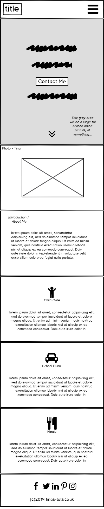
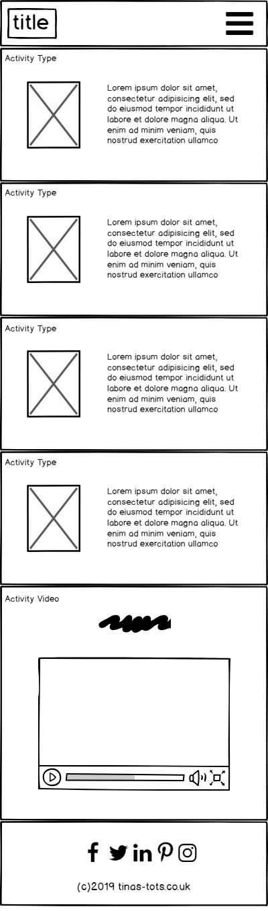
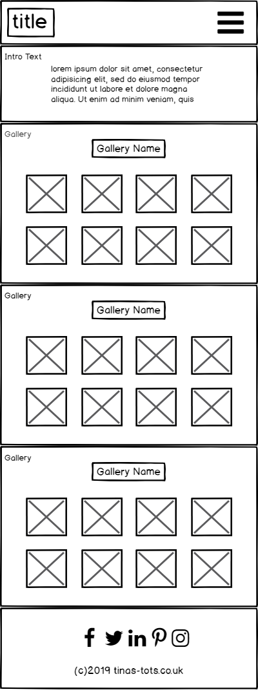
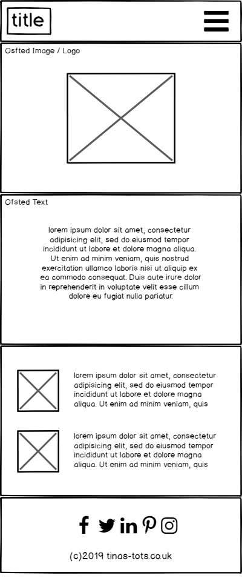
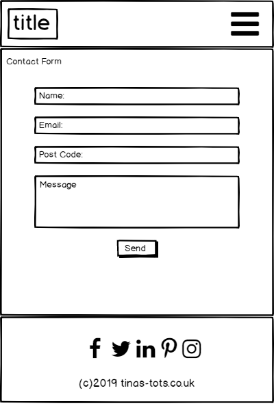
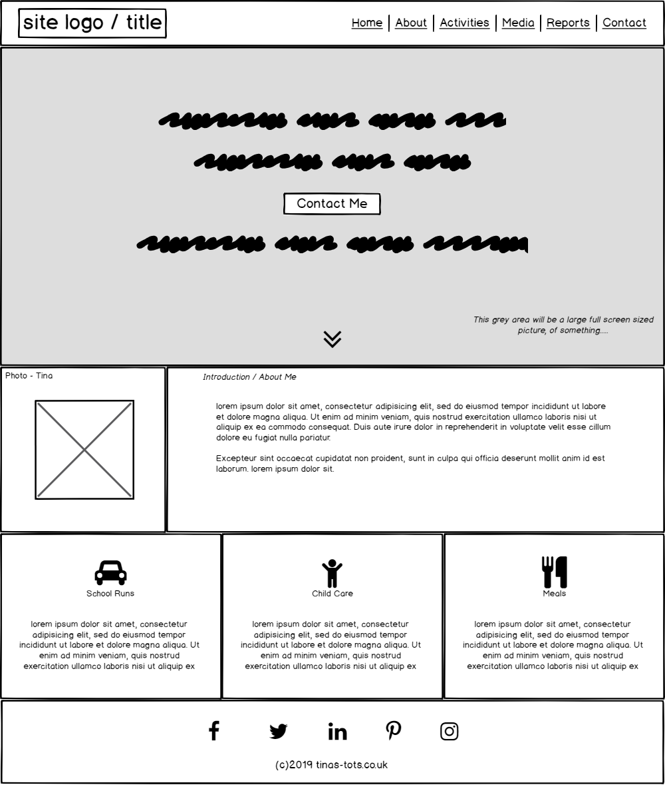
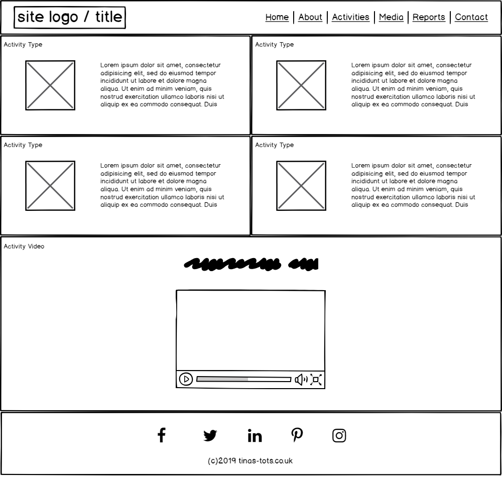
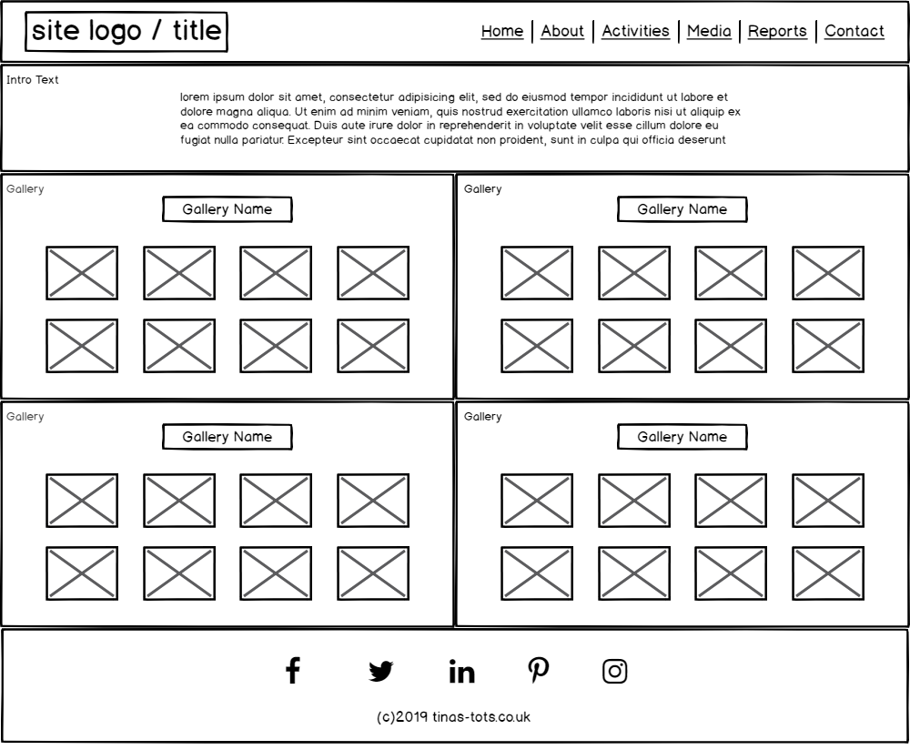
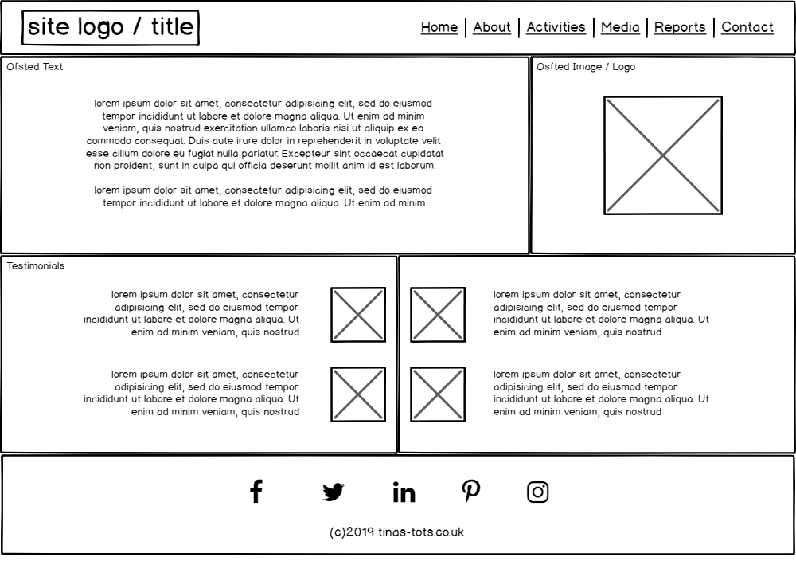
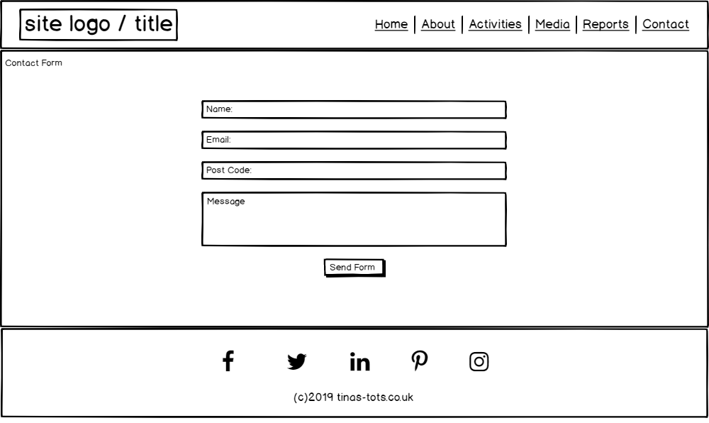

# Tina's Tots
## Code Institute Milestone Project One - UCD

A fully responsive 5-page static website for a home-based child-minding business. The site consists of a landing page with a short headline that encourages users to make contact. This scrolls down into a section that gives the user information on Tina, the child minder, and the services she offers. 

The other pages in the site continue to build on the information already offered by creating a picture of what parents can expect when their child is placed in Tina's care. The final page is a contact form that allows the user to call Tina direct, or fill out a form and have Tina contact them.

The current deployed version can be found at https://steview-d.github.io/tinas-tots/
 
## UX

This site acts as a sales tool for the services provided by Tina's Tots.
The site should not provide every last detail and instead provide enough information to make the user want to get in touch and find out more.
The site should provide multiple ways of making contact, and this information should be easily accessible from any part of the site.

### User Stories
* As a parent looking for child care for my child, I want to be able to see if Tina's Tots meets mine and my child's needs.
* As a parent interested in Tina's Tots, I want to be able to communicate with Tina to ask questions and / or book her services.
* As the owner of Tina's Tots, I want to be able to show what I can offer to parents and children in a clear and concise format.
* As the owner of Tina's Tots, I want potential customers to be able to get in touch with me quickly, easily, and in a way that is most convenient for them.

### Wireframes

The wireframes below are the original ones created at the start of this project.
Whilst the overall feel is mostly similar, the current version does have some differences to what was initially planned.

The original design was cluttered in places, and this made it hard to read, which led to a poor user experience.
Most of the changes made have been a move towards a less cluttered and more user-friendly experience.

#### Mobile
###### Home / About | Activities | Photos | Reports | Contact
&nbsp;&nbsp;&nbsp;&nbsp;

#### Desktop
###### Home / About | Activities | Photos | Reports | Contact
&nbsp;&nbsp;&nbsp;&nbsp;

## Features

### Current Features
###### Feature 1 - Navigation bar. 
- A fixed navigation bar that stays in place when the user scrolls down the page ensuring all parts of the site can be accessed with ease.
- On widths of less than 768px the navigation bar condenses down in to the 'burger' style to save space.

###### Feature 2 - Footer.
- A simple footer containing links to the social media platforms of the site owner, and a single line of copyright text. Currently, the social media links only open the respective platforms home page. These will be updated once actual social media profiles are created.

###### Feature 3 - Full screen landing page.
- The landing page adjusts to the users screen size so all users are initially greeting with a full screen image (including nav-bar) overlaid with text to show what the site is about, and giving the user their first option to make contact.

###### Feature 4 - About section.
- An introductory section allowing the site owner to give their sales pitch in full. A picture of Tina from Tina's Tots is included to help users make a connection with the person who would potentially be looking after their children.

###### Feature 5 - Services.
- This section follows on directly from the sales pitch and details what services are available. These sections are purposefully brief to reduce clutter and encourage the user to get in touch with questions.

###### Feature 6 - Activities.
- A section designed to show the different activities the user can expect their child to be involved in.

###### Feature 7 - Video.
- A video showing how Tina interacts with the children in her care. This usually involves singing.

###### Feature 8 - Photos.
- A full-page photo section using the carousel feature of bootstrap to display photos of previous events and activities that have taken place.
- Media queries have been used to load narrower images on views <768px to speed up page load times.

###### Feature 9 - Ofsted.
- This section talks about OFSTED, the regulatory body for Tina's Tots. It is used to build trust by highlighting positive previous inspections.
- Links are provided to external pages in new tabs to allow the user to view these reports themselves.

###### Feature 10 - Testimonials.
- Quotes taken from current and previous clients with positive things to say about their experience. The quotes are real, the pictures are placeholders sourced via Google images (with usage rights).

###### Feature 11 - Contact.
- A short contact form that gives the user the opportunity to pass their details on so Tina can get in touch. It also provides a telephone number, allowing the user to make contact immediately, instead of waiting for a call or email back.

### Future Features
###### Contact form submission.
- Currently, the form doesn't do anything with the data submitted.

###### Live chat functionality.
- The purpose of this site is to allow communication between the user and site owner, so it makes sense to provide as many ways of doing this as possible.

###### Availability checker.
- I would like to add a feature which can check spaces available, and their times, and display these for the user to see. I would also like to provide the option of allowing the user to input what they require, and the site can check to see if the user can be accommodated.

###### News & updates.
- This would be for existing clients and could either take the form of a simple email capture to add them to a list, or a section requiring a sign in which gives them access to news and updates that is hidden from other users.

## Technologies Used

The following technologies were used in the design and build of this project.

#### [Balsamiq](https://balsamiq.com/) 
- Balsamiq was used for creating the wireframes during the design stage.

#### [HTML5](https://www.w3.org/TR/html/) & [CSS3](https://www.w3.org/Style/CSS/)
- HTML5 & CSS3 were used to create the layout and styling of this site

#### [AWS Cloud9](https://aws.amazon.com/cloud9/)
- Cloud9 IDE editor used to write the HTML & CSS.

#### [Bootstrap](https://www.bootstrapcdn.com/)
- Bootstrap v3.3.7 was used to create a mobile first fully responsive grid structure for the site and the navigation bar.

#### [JavaScript & jQuery](https://jquery.com/)
- JavaScript & jQuery are used in this site to support Bootstrap's handling of the mobile navigation bar and the Carousel used in the photos section.

#### [Adobe Fonts](https://fonts.adobe.com/)
- The Adobe font library was used for all the fonts contained within this site. The specific fonts used were
    - Capucine Basic, Light - The primary font used across the site.
    - Chauncy Pro, Bold - Used for the navigation bar.
    - Balloon URW, Bold - Used on the landing page.

#### [Adobe Photoshop CC](https://www.photoshop.com/)
- Photoshop was used to crop, edit and export for use, all photos used throughout this site.

#### [Tiny JPG](https://tinyjpg.com/)
- Tiny JPG was used to reduce the size of all .jpg's to assist with page loading times where large images are used - specifically the landing page and photos section.

#### [Font Awesome](https://origin.fontawesome.com/)
- Font Awesome was used to provide the icons for the site footer, the icons used in the services section on the 'about' page, and the 'i' on the contact form for required fields.

#### [Git & GitHub](https://github.com/)
- Git used for version control. GitHub used as a remote repository and the hosting of this site.

## Testing

This site has been extensively tested in a number of ways.

The following browsers have been tested
- Chrome, Opera, Firefox, Edge, and Internet Explorer.

The Chrome Dev Tools have been used to test all pages at all widths across numerous simulated devices to confirm pages display exactly as intended.
The simulated devices tested were
- Galaxy S5
- Google Pixel 2
- iPhone 5/SE, 6/7/8, and X
- iPad & iPad Pro

Dev tools were also used to test between the widths of 300px up to 3840px and the pages remain intact and fully responsive.

I have also tested on the following physical devices, and again, no issues have been encountered.
- Windows desktop at HD, QHD, and UWQHD resolutions
- Google Pixel 2XL
- Apple iPhone 8S

The sites main purpose is to allow the user and owner to contact each other, and this functionality has been tested. There are 2 methods of contact provided.

A telephone number.

- A contact telephone number is displayed in 2 areas of the site - the landing page and contact page
- When touched on a mobile device, it enters the mobile number into the phone ready to make a call.

A contact form.

- The contact form checks to make sure the 2 required fields are completed - name & telephone number.
- When submitting, if the user leaves out either of these fields, a message informs the user that the field is required and instructs them to complete it before submitting.
- The reset button works to clear the form of any data entered.
- The form is not currently linked to an external server so when the user presses send, the form resets itself.
- Implementing this functionality was outside of the scope of this project but will be added at a later date.

## Deployment

This project is currently published on GitHub pages, and can be viewed at:

https://steview-d.github.io/tinas-tots/

## Credits

### Content
- All wording checked and approved by Tina, the owner of Tina's Tots.

### Media
- Photographs used with permission from Tina's Tots.
- Video of the 'sing-a-long' used with permission from Tina's Tots.
- OFSTED 'Good' logo used with permission from OFSTED.
- Pictures from the 'Meet the Parents' section sourced via Google image search. All pictures had full usage rights and were labelled for reuse by Google. 
- Favicon icon sourced from https://www.freefavicon.com/ and used with permission.

### Acknowledgements

- Thanks to [Antonija Šimić](https://github.com/tonkec "Antonija's GitHub page"), my Code Institute mentor, for her advice and guidance during the completion of this project.
- [Stack Overflow](https://stackoverflow.com/) for saving my sanity on more than one occasion.
- The slack channel community over at [Code Institute](https://codeinstitute.net/) for their quick and friendly advice when needed.
- Tina, owner of Tina's Tots, for providing all the materials needed to help complete this project.

